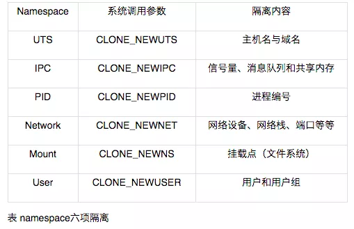

## docker 命名空间

**命名空间**是Linux内核的一个强大特性，为容器虚拟化的实现带来极大便利，利用这特性，每个容器都可拥有自己单独的命名空间，运行在其中的应用都是在独立的操作系统环境中一样，命名空间机制保证了容器之间彼此互不影响

在操作系统中，包括内核、文件系统、网络、进程号（ Process ID, PID ）、用户号（ UserID, UID 进程间通信（ Inter Process Communication, IPC ）等资源，所有的资源都是应用进程直接共享的，要想实现虚拟化，除了要实现对内存、 CPU 、网络 IO 、硬盘 IO 、存储空间等的限制外，还要实现文件系统、网络、 PID UID IPC 等的相互隔离 前者相对容易实现一些，后者则需要宿主主机系统的深入支持。

随着 Linux 系统对于命名空间功能的逐步完善，现在已经可以实现这些需求，让进程在彼此隔离的命名空间中运行 虽然这些进程仍在共用同 个内核和某些运行时环境(runtime ，例如一些系统命令和系统库），但是彼此是不可见的，并且认为自己是独占系统的
Docker 容器每次启动时候，通过调用 func setNamespaces(daemon *Daemon, s *specs. Spec, c *container.Container) error 方法来完成对各个命名间的配置。

#### MNT Namespace技术

每个容器都要有独立的根文件系统有独立的用户空间， 以实现在容器里面启动服务并且使用容器的运行环境，即一个宿主机是 ubuntu 的服务器，可以在里面启动一个 centos 运行环境的容器并且在容器里面启动一个 Nginx 服务，此 Nginx运行时使用的运行环境就是 centos 系统目录的运行环境， 但是在容器里面是不能访问宿主机的资源， 宿主机是使用了 chroot 技术把容器锁定到一个指定的运行目录里面。

例如： /var/lib/containerd/io.containerd.runtime.v1.linux/moby/容器 ID

#### IPC Namespace：

一个容器内的进程间通信， 允许一个容器内的不同进程的(内存、 缓存等)数据访问，但是不能夸容器访问其他容器的数据。

#### UTS Namespace：

UTS namespace（ UNIX Timesharing System 包含了运行内核的名称、版本、底层体系结构类型等信息）用于系统标识， 其中包含了 hostname 和域名domainname ， 它使得一个容器拥有属于自己 hostname 标识，这个主机名标识独立于宿主机系统和其上的其他容器。

#### PID Namespace：

Linux 系统中，有一个 PID 为 1 的进程(init/systemd)是其他所有进程的父进程， 那么在每个容器内也要有一个父进程来管理其下属的子进程，那么多个容器的进程通过 PID namespace 进程隔离(比如 PID 编号重复、 器内的主进程生成与回收子进程等)

#### Net Namespace：

每一个容器都类似于虚拟机一样有自己的网卡、 监听端口、 TCP/IP 协议栈等，Docker 使用 network namespace 启动一个 vethX 接口，这样你的容器将拥有它自己的桥接 ip 地址，通常是 docker0，而 docker0 实质就是 Linux 的虚拟网桥,网桥是在 OSI 七层模型的数据链路层的网络设备，通过 mac 地址对网络进行划分，并且在不同网络直接传递数据。

#### User Namespace：

各个容器内可能会出现重名的用户和用户组名称， 或重复的用户 UID 或者GID， 那么怎么隔离各个容器内的用户空间呢？User Namespace 允许在各个宿主机的各个容器空间内创建相同的用户名以及相同的用户 UID 和 GID， 只是会把用户的作用范围限制在每个容器内，即 A 容器和 B 容器可以有相同的用户名称和 ID 的账户，但是此用户的有效范围仅是当前容器内， 不能访问另外一个容器内的文件系统，即相互隔离、互补影响、 永不相见。

#### Linux控制组

Linux control groups：
在一个容器，如果不对其做任何资源限制，则宿主机会允许其占用无限大的内存空间， 有时候会因为代码 bug 程序会一直申请内存，直到把宿主机内存占完， 为了避免此类的问题出现， 宿主机有必要对容器进行资源分配限制，比如CPU、内存等， Linux Cgroups 的全称是 Linux Control Groups， 它最主要的作用，就是限制一个进程组能够使用的资源上限，包括 CPU、内存、磁盘、网络带宽等等。此外，还能够对进程进行优先级设置，以及将进程挂起和恢复等操作。

