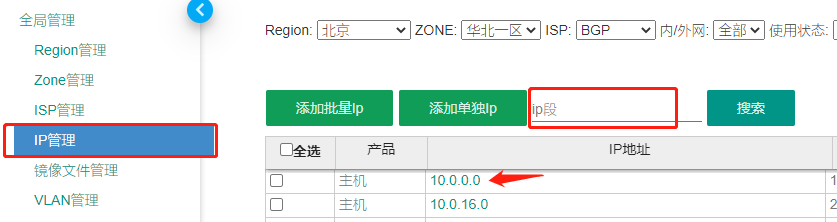
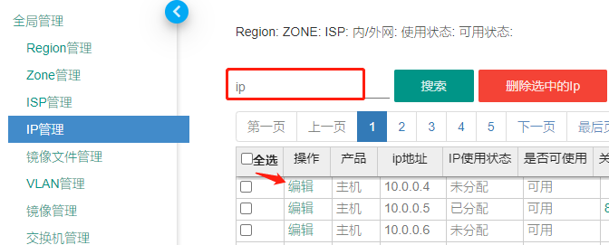
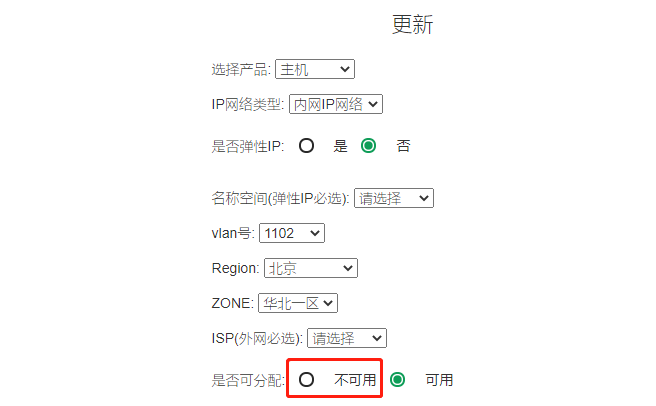

# ip举报封禁

> 当收到来自 **jubao@xinnet.com** 的ip封禁申请邮件时，除了上端网络需要封禁外，内部集群也要进行封禁处理，步骤如下

### 一、ip查询

根据邮件中的ip到boss管理平台中进行查询，主要获取以下两点信息
- 所在区域
- 老平台 or openstack平台？

### 二、封禁处理

#### 2.1 老平台 

- 登陆boss管理平台

- 全局管理 ==> IP管理 ==> 搜索ip段 ==> 点击ip段

  

- 搜索待封禁ip ==> 选择编辑

  

  

- 更改为不可用 ==>  确定更新

  

#### 2.2 openstack平台

- 登陆所在区域的 `controller1`节点

- 执行以下命令

  `sh /data/sunjianxing/crontab/block_ip.sh 待封禁ip`  #无回显或回显1代表成功，其他表示失败

